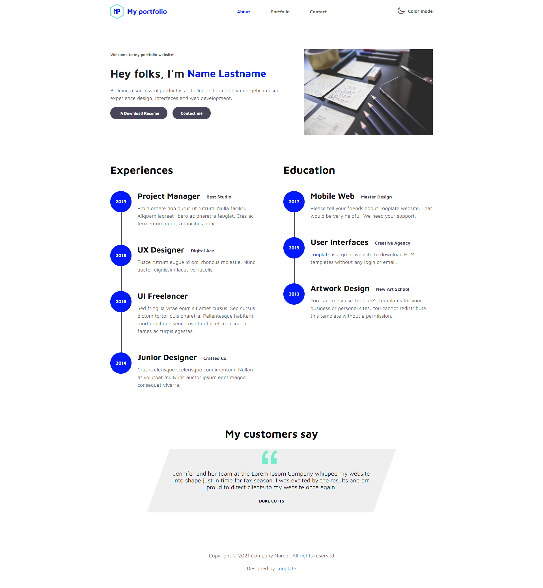

<!-- INTRO SECTION -->
<section>
    <h1>MY PERSONAL PORTFOLIO</h1>
    

        This is a Continuous Assesment Activity of the <a href="https://www.uoc.edu/portal/_resources/common/imatges/sala_de_premsa/noticies/2016/202-nova-marca-uoc.jpg">Techniques for Software Application Development Degree</a>
    

</section>
<!-- GENERAL SPECIFICATIONS -->
<section>
        <h1>General Specifications</h1>
        
            <ul>
                <li>
                    

                        We divide the <code>&#60;body&#62;</code> in 3 main sections, <code>&#60;header&#62;</code>, <code>&#60;main&#62;</code> and <code>&#60;footer&#62;</code>
                    

                </li>
                <li>
                    
 
                        We remove the default <code>&#60;body&#62;</code> margin and set the default text color of the document.
                    

<pre>
    <code>
        body {
            margin: 0;
            color:  #0c0c0d;
        }
    </code>
</pre>
                </li>
                <li>
                    

                        Inside each section, we use a <code>&#60;div&#62;</code> element with class <i>container</i> to limit the  width of all the website's information to 1000px, and to center it.
                        In this way, we can apply a border to each section to draw a dividing line that takes up the whole viewport width, and then make the content inside each section narower and centered.
                    

<pre>
    <code>
        .container {
            max-width: 1000px;
            margin: 0 auto;
        }
    </code>
</pre>
                </li>
            </ul>
            <!-- 
            HEADER
            -->
            <h2>Header</h2>
                <ul>
                    <li>
                        The header is composed of three elements, two <code>&#60;div&#62;</code>s and a central <code>&#60;nav&#62;</code>, that represents a navigation menu that allows the user to change between the 3 pages.
                        Each <code>&#60;div&#62;</code> is composed of one image and one <code>&#60;p&#62;</code>.
                        With the next CSS ruleset we make the two elements inside each <code>&#60;div&#62;</code> place aligned next to each other.
<pre>
    <code>
        header .container,
        header div {
        display: flex;
        justify-content: space-between;
        align-items: center;
        }
    </code>
</pre>              
                        With this rule, we also make the <code>&#60;div class="container"&#62;</code> inside the header a flex box, so the two <code>&#60;div&#62;</code>s and the <code>&#60;nav&#62;</code> place next to each other. Then with the <i>justif-content</i> property we add space between these elements forcing them to take the whole space of the container. Finally, we make the elements align vertically next to each other.
                    </li>
                    <li>
                        The central navbar has one <code>&#60;ul&#62;</code>, whose <code>&#60;li&#62;</code>s has one <code>&#60;a&#62;</code> inside to link to the rest of the pages.
                    </li>
                    <li>
                        We make all the text inside bold, divide the <code>&#60;header&#62;</code> from the <code>&#60;main&#62;</code> using a border and finally we make it wider.
    <pre>
        <code>
            header {
                font-weight: bold;
                border-bottom: 1px solid rgba(128, 128, 128, 0.5);
                padding: 15px 0;
            }
        </code>
    </pre>
                    </li>
                    <li>
                        We make tha navbar (central section of the header) take up 35% of the container space, so there is space between the 3 <code>&#60;li&#62;</code>s inside the navbar.
    <pre>
        <code>
            nav {
                width: 35%;
            }
        </code>
    </pre>
                    </li>
                    <li>
                        Now that the navbar have space, we turn it into a flexbox so each nav item place next to each other. We remove the list bullets. Finally, we give space between the elements inside the navbar.
    <pre>
        <code>
            nav ul {
                display: flex;
                list-style: none;
                justify-content: space-between;
            }
        </code>
    </pre>
                    </li>
                    <li>
                        We make blue the nav items when the user hover them, or when it's the page that the user it's currently visiting (because it has no href attribute in the active item)
    <pre>
        <code>
            header a:not(a[href]),
            header a:hover {
            color: #0019ff;
        }
        </code>
    </pre>
                    </li>
                     </li>
                    <li>
                        We remove the default anchor color and underline.
    <pre>
        <code>
            header a {
                color: #0c0c0d;
                text-decoration: none;
            }
        </code>
    </pre>
                    </li>
                    <li>
                        Finally, we select only the first <code>&#60;div&#62;</code> inside the header (the logo and title), and make its font blue and a little bigger.
    <pre>
        <code>
            header .container div:first-child {
            font-size: 1.5rem;
            color: #1b1fff;
        }
        </code>
    </pre>
                    </li>
                </ul>
</section>
<section>

</section>