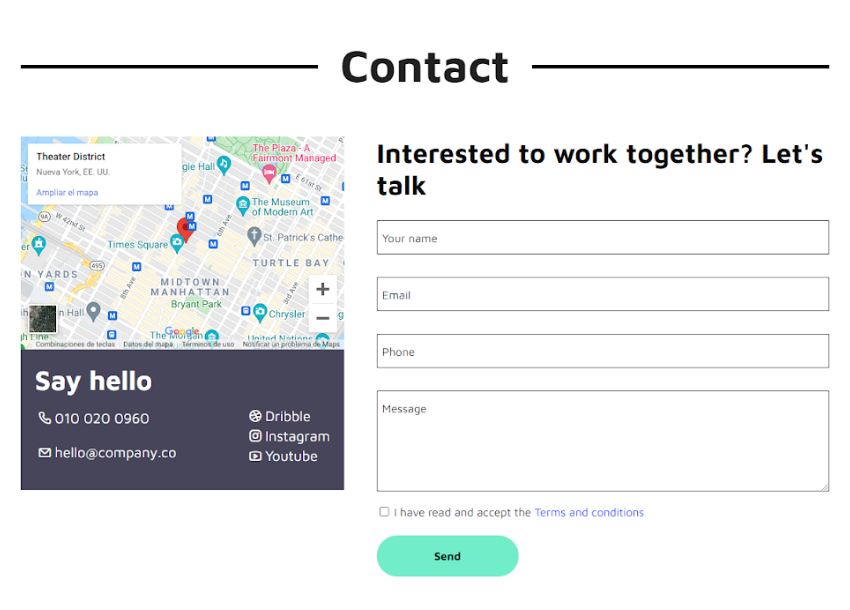

<link rel="stylesheet" href="css/readme-styles.css">

<!-- INTRO SECTION -->
<section>
    <h1>MY PERSONAL PORTFOLIO</h1>
    

        This is a Continuous Assesment Activity of the <a href="https://www.uoc.edu/portal/_resources/common/imatges/sala_de_premsa/noticies/2016/202-nova-marca-uoc.jpg">Techniques for Software Application Development Degree</a>
    

</section>
<!-- NAV BAR -->
<section id="nav">
    <ul>
        <li>
            <button>
                <a  class="button" href="#header">Header</a>
            </button>
        </li>
        <li>
            <button>
                <a class="button" href="#footer">Footer</a>
            </button>
        </li>
        <li>
            <button>
                <a class="button" href="#about">About Page</a>
            </button>
        </li>
        <li>
            <button>
                <a class="button" href="#portfolio">Portfolio Page</a>
            </button>
        </li>
        <li>
            <button>
                <a class="button" href="#contact">Contact Page</a>
            </button>
        </li>
    </ul>
</section>
<!-- GENERAL SPECIFICATIONS -->
<section>
        <h1>General Specifications</h1>
            <ul>
                <li>
                    

                        We divide the <code>&#60;body&#62;</code> in 3 main sections, <code>&#60;header&#62;</code>, <code>&#60;main&#62;</code> and <code>&#60;footer&#62;</code>
                    

                </li>
                <li>
                    
 
                        We remove the default <code>&#60;body&#62;</code> margin and set the default text color of the document.
                    

<pre>
    <code>
        body {
            margin: 0;
            color:  #0c0c0d;
        }
    </code>
</pre>
                </li>
                <li>
                    
 
                        Using <i>@font-face</i>, we let the <a href="https://fontawesome.com/">Font Awesome</a> icons ready to use when using the font-family property with value <i>unicons</i>-.
                    

<pre>
    <code>
        @font-face {
            font-family: 'unicons';
            src: url('../font/unicons.eot?42479262');
            src: url('../font/unicons.eot?42479262#iefix') format('embedded-opentype'),
                url('../font/unicons.woff2?42479262') format('woff2'),
                url('../font/unicons.woff?42479262') format('woff'),
                url('../font/unicons.ttf?42479262') format('truetype'),
                url('../font/unicons.svg?42479262#unicons') format('svg');
            font-weight: normal;
            font-style: normal;
        }
    </code>
</pre>
                </li>
                <li>
                    
 
                        Now we use the psudo-element <i>::before</i> to create an element as a first child of the elements of the website where we will need to use icon, that are, the section with contact information below the Google Maps' iframe in the Contact Page, and the Download resume button in the About page.
                    

<pre>
    <code>
        .contact .contact-info p::before,
        .presentation a:first-child::before {
            font-family: "unicons";
            font-style: normal;
            font-weight: normal;
            speak: none;
            display: inline-block;
            text-decoration: inherit;
            width: 1em;
            margin-right: .2em;
            text-align: center;
            /* For safety - reset parent styles, that can break glyph codes*/
            font-variant: normal;
            text-transform: none;
            /* fix buttons height, for twitter bootstrap */
            line-height: 1em;
            /* Animation center compensation - margins should be symmetric */
            /* remove if not needed */
            margin-left: .2em;
            /* you can be more comfortable with increased icons size */
            /* font-size: 120%; */
            /* Font smoothing. That was taken from TWBS */
            -webkit-font-smoothing: antialiased;
            -moz-osx-font-smoothing: grayscale;
            /* Uncomment for 3D effect */
            /* text-shadow: 1px 1px 1px rgba(127, 127, 127, 0.3); */
        }
    </code>
</pre>
                </li>
                <li>
                    

                        Inside each section, we use a <code>&#60;div&#62;</code> element with class <i>container</i> to limit the  width of all the website's information to 1000px, and to center it.
                        In this way, we can apply a border to each section to draw a dividing line that takes up the whole viewport width, and then make the content inside each section narower and centered.
                    

<pre>
    <code>
        .container {
            max-width: 1140px;
            margin: 0 auto;
        }
    </code>
</pre>
                </li>
                <li>
                    

                        We use the <code>&#60;p&#62;</code> as the default element to wrap text in the website, so by setting its size here, we set the default <i>font-size</i> of the document.
                    

<pre>
    <code>
        p {
            font-size: 18px;
        }
    </code>
</pre>
                </li>
            </ul>
            <!-- 
            HEADER
            -->
            <h2 id="header">Header</h2>
            
                <ul>
                    <li>
                        The header is composed of three elements, two <code>&#60;div&#62;</code>s and a central <code>&#60;nav&#62;</code>, that represents a navigation menu that allows the user to change between the 3 pages.
                        Each <code>&#60;div&#62;</code> is composed of one image and one <code>&#60;p&#62;</code>.
                        With the next CSS ruleset we make the two elements inside each <code>&#60;div&#62;</code> get aligned next to each other.
<pre>
    <code>
        header .container,
        header div {
        display: flex;
        justify-content: space-between;
        align-items: center;
        }
    </code>
</pre>              
                        With this rule, we also make the <code>&#60;div class="container"&#62;</code> inside the header a flex box, so the two <code>&#60;div&#62;</code>s and the <code>&#60;nav&#62;</code> place next to each other. Then with the <i>justif-content</i> property we add space between these elements forcing them to take the whole space of the container. Finally, we make the elements align vertically next to each other.
                    </li>
                    <li>
                        The central navbar has one <code>&#60;ul&#62;</code>, whose <code>&#60;li&#62;</code>s has one <code>&#60;a&#62;</code> inside to link to the rest of the pages.
                    </li>
                    <li>
                        We make all the text inside the header bold and divide the <code>&#60;header&#62;</code> from the <code>&#60;main&#62;</code> using a border.
                        Then we add some space at the left and right of the header and make the header text bigger.
    <pre>
        <code>
            header {
                font-weight: bold;
                border-bottom: 1px solid rgba(128, 128, 128, 0.5);
                padding: 15px 10px;
                font-size: 1.1rem;
            }
        </code>
    </pre>
                    </li>
                    <li>
                        We make tha navbar (central section of the header) take up 35% of the container space, so there is space between the 3 <code>&#60;li&#62;</code>s inside the navbar.
    <pre>
        <code>
            nav {
                width: 35%;
            }
        </code>
    </pre>
                    </li>
                    <li>
                        Now that the navbar have space, we turn it into a flexbox so each nav item place next to each other. We remove the list bullets. Finally, we give space between the elements inside the navbar.
    <pre>
        <code>
            nav ul {
                display: flex;
                list-style: none;
                justify-content: space-between;
            }
        </code>
    </pre>
                    </li>
                    <li>
                        We make blue the nav items when the user hover them, or when it's the page that the user it's currently visiting (because the active item has no href attribute)
    <pre>
        <code>
            header a:not(a[href]),
            header a:hover {
            color: #0019ff;
        }
        </code>
    </pre>
                    </li>
                     </li>
                    <li>
                        We remove the default anchor color and underline.
    <pre>
        <code>
            header a {
                color: #0c0c0d;
                text-decoration: none;
            }
        </code>
    </pre>
                    </li>
                    <li>
                        Finally, we select only the first <code>&#60;div&#62;</code> inside the header (the logo and title), and make its font blue and a little bigger.
    <pre>
        <code>
            header .container div:first-child {
                font-size: 1.5rem;
                color: #1b1fff;
            }
        </code>
    </pre>
                    </li>
                </ul>
        <!-- 
            FOOTER
            -->
            <h2 id="footer">Footer</h2>
            
                <ul>
                    <li>
                        The <code>&#60;footer&#62;</code> is composed of only two <code>&#60;p&#62;</code>s, one for each line of text.
                        In the second line, we have an <code>&#60;a&#62;</code> with the <i>href</i> attribute set to <i>_blank</i>, so that the page opens in a new tab.
                    </li>
                    <li>
                        We turn the <code>&#60;footer&#62;</code> into a flexbox, and use the flex-direction to place each <code>&#60;p&#62;</code> above each other. Then we can use <i>justify-content</i> and <i>align-items</i> together to plce both lines in the center of the <code>&#60;footer&#62;</code>.
                        Then we give some space at the top and bottom, and finally we add a <i>border-top</i> to ivide the <code>&#60;footer&#62;</code> from the <code>&#60;main&#62;</code> section.
    <pre>
        <code>
            footer {
                display: flex;
                flex-direction: column;
                justify-content: center;
                align-items: center;
                padding: 20px 0;
                border-top: 1px solid rgba(128, 128, 128, 0.5);
            }
        </code>
    </pre>
                    </li>
                    <li>
                       We set the default color of the link that is inside the footer, and remove the underline, because we will use it when the user hovers the <code>&#60;a&#62;</code> to indicate him that is clickable.
    <pre>
        <code>
            footer a {
                color:  #0019ff;
                text-decoration: none;
            }
            footer a:hover {
                text-decoration: underline;
            }
        </code>
    </pre>
                    </li>
                </ul>
        <!-- 
            'ABOUT' PAGE MAIN
            -->
            <h1 id="about">About Page</h1>
            
            <ul>
                <li>
                    The <code>&#60;main&#62;</code> section of 'About' page is composed of five <code>&#60;section&#62;</code>s
                    <ul>
                        <li>Presentation (top left)</li>
                        <li>Picture (top right)</li>
                        <li>Experiences (middle left)</li>
                        <li>Education (middle right)</li>
                        <li>Customers experience (bottom)</li>
                    </ul>
                </li>
                <li>
                    In the prensentation <code>&#60;section&#62;</code> we have two <code>&#60;p&#62;</code>s, with a <code>&#60;h1&#62;</code> between them, and below all of them, a <code>&#60;div&#62;</code> containing two <code>&#60;a&#62;</code>s, each containing a <code>&#60;button&#62;</code> inside.
                </li>
                <li>
                    The picture <code>&#60;section&#62;</code> is just a container for an <code>&#60;img&#62;</code>.
                </li>
                <li>
                    Both Experiences and Education <code>&#60;section&#62;</code>s are marked up in a similar way.
                    First they have a <code>&#60;h2&#62;</code> and then a a div that represents the line that will go through the dates' circles.
                    Finally a collection of <code>&#60;div&#62;</code>s, where each one represents an experience/education item.
                    Inside each of them we have to <code>&#60;div&#62;</code>s, one containing the date, and the other, the rest of the information.
                    This second <code>&#60;div&#62;</code> is composed of another <code>&#60;div&#62;</code> for the headings, and a <code>&#60;p&#62;</code> for the experience/education description.
                </li>
                <li>
                    Finally, at the bottom of the page it's the curstomers opinion <code>&#60;section&#62;</code>, that it's just a <code>&#60;h1&#62;</code>, and below, a <code>&#60;blockquote&#62;</code>, with a <code>&#60;p&#62;</code> and a <code>&#60;cite&#62;</code> inside.
                </li>
                <li>
                        Regarding CSS, we turn the <code>&#60;main&#62;</code>'s information container into a gird, and the split this grid in 12 columns of the same width. Then we add some space at the top and bottom.
                        Finally, we give <i>50px</i> of space between the three rows we will create.
    <pre>
        <code>
            .about .container {
                display: grid;
                grid-template-columns: repeat(12, 1fr);
                padding: 50px 0;
                row-gap: 50px;
            }
        </code>
    </pre>
                </li>
                <li>
                       We set the font sizes of all the headings of the page, and slightly change the color of the level one heading.
    <pre>
        <code>
            .about h1 {
                font-size: 40px;
                color: #212121;
            }
                .about h2 {
                font-size: 38px;
            }
                .about h3 {
                font-size: 28px;
            }
        </code>
    </pre>
                </li>
                <li>
                       We set the font sizes of all the headings of the page, and slightly change the color of the level one heading.
    <pre>
        <code>
            .about h1 {
                font-size: 40px;
                color: #212121;
            }
                .about h2 {
                font-size: 38px;
            }
                .about h3 {
                font-size: 28px;
            }
        </code>
    </pre>
                </li>
                <li>
                       We set the position of the upper left section to take up 7 columns.
    <pre>
        <code>
            .presentation {
                grid-column: 1 / 8;
            }
        </code>
    </pre>
                </li>
                <li>
                       Then we give styles to the buttons of this section.
                       First we make them bigger using <i>padding</i>.
                       Then we make them rounded and set the color of background and the font.
                       We make the text inside the buttons bold, set the font-size and remove the underline of anchors.
    <pre>
        <code>
            .presentation a {
                padding: 10px 20px;
                border-radius: 25px;
                background-color: #474559;
                color: white;
                font-weight: bold;
                font-size: 15px;
                text-decoration: none;
            }
        </code>
    </pre>
                </li>
                <li>
                       Now we style the first button.
                       We give some space between it and the second one.
                       Then we set the width of the buttom to be able to contain all its content.
    <pre>
        <code>
            .presentation a:first-child {
                margin-right: 10px;
                width: fit-content;
            }
        </code>
    </pre>
                </li>
                <li>
                       We insert the <a href="https://fontawesome.com/">Font Awesome</a> at the beginning of the button.
    <pre>
        <code>
            .presentation a:first-child:before {
                content: '\e9b8';
            }
        </code>
    </pre>
                </li>
                <li>
                       Finally we add some interactivity to buttons. When the user hovers them, the cursor will turn into a pointer, and the background color will change.
    <pre>
        <code>
            .presentation a:hover {
                cursor: pointer;
                background: #0019ff;
            }
        </code>
    </pre>
                </li>
                <li>
                       Finally we set a specific color for my name and surname.
    <pre>
        <code>
            .presentation h1 span {
                color: #0019ff;
            }
        </code>
    </pre>
                </li>
                <li>
                       Now we have a couple rulesets to style the image section.
                       We place it in the remaining space at the first row.
                       Then, we make the actual image take up only 90% of this space, and then float to the right so we have space between the twoupper sections.
    <pre>
        <code>
            .ux-designer {
                grid-column: 8 / 13;
            }
                .ux-designer img {
                width: 90%;
                float: right;
            }
        </code>
    </pre>
                </li>
                <li>
                       Regarding Experiences/Education section, we make it take up the first 6 columns of the next available row (the second one).
                       We give some space with the Education section.
                       Finally, we set the position to relative, in order to preserve its current position, but allowing to place the line that goes through the dates in an absolute way, bout relative to this this section, not the viewport.
    <pre>
        <code>
            .experiences {
                grid-column: 1 / 7;
                padding-right: 20px;
                position: relative;
            }
        </code>
    </pre>
                </li>
                <li>
                    Then we give the empty <code>&#60;div&#62;</code> with <i>class="line"</i> a width of <i>3px</i> and a height enough to go through all dates' circles.
                    It's important to set the height value using a percentage, because if the viewport gets smaller, and therefore tge experiences/education <code>&#60;section&#62;</code> streches up and gets higher, the line will get longer too.
    <pre>
        <code>
            .line {
                width: 3px;
                height: 70%;
                top: 150px;
                left: 33px;
                background-color: #474559;
                position: absolute;
                z-index: -1;
            }
        </code>
    </pre>
                </li>
                <li>
                    We make the each experience/education item a flexbox, so the date is placed next to the information itself.
                    Then we make both divs align to the left.
    <pre>
        <code>
            .list-item {
                display: flex;
                align-items: start;
            }
        </code>
    </pre>
                </li>
                <li>
                    Now we give a margin to all items except the first one, so we give space between them.
    <pre>
        <code>
            .list-item:nth-child(n+2) {
                margin-top: 35px;
            }
        </code>
    </pre>
                </li>
                <li>
                    Now we give a margin to all items except the first one, so we give space between them.
    <pre>
        <code>
            .list-item:nth-child(n+2) {
                margin-top: 35px;
            }
        </code>
    </pre>
                </li>
                <li>
                    We remove the default top margins from headings.
    <pre>
        <code>
            .list-item h2,
            .list-item h3,
            .list-item h4 {
                margin-top: 0;
            }
        </code>
    </pre>
                </li>
                <li>
                    We turn the title's section of each experience/education into a flexbox, so the company/school get placed next to the experience/education main title.
                    Then, we align them to the center in the y-axis
    <pre>
        <code>
            .list-item .title {
                display: flex;
                align-items: center;
            }
        </code>
    </pre>
                </li>
                <li>
                    Now we give some space between the experience/education item title and the company/school name., and we also remove the bottom margin.
    <pre>
        <code>
            .list-item .title h3 {
                margin-right: 15px;
                margin-bottom: 0;
            }
        </code>
    </pre>
                </li>
                <li>
                    Regarding the company/school name, we give it an specific font colot, we make it smaller, also remove the bottom margin, and finally, we set the position to relative to be able to move it down a little bit.
    <pre>    
        <code>
            .list-item .title h4 {
                color: #474559;
                font-size: 14px;
                margin-bottom: 0;
                position: relative;
                top: 2px;
            }
        </code>
    </pre>
                </li>
                <li>
                    Talking about the dates' circles, we give them a blue background, add the same padding to all sides of the date to make the date's <code>&#60;div&#62;</code> bigger but squared.
                    Now we set the <i>border-radius</i> to 50% in order to create a circle.
                    We set the font color to white, make the font semi-bold and add some margin-right to give space between the circle and the item information. 
    <pre>
        <code>
            .date {
                background-color: #0019ff;
                padding: 15px;
                border-radius: 50%;
                color: white;
                font-weight: 600;
                margin-right: 25px;
            }
        </code>
    </pre>
                </li>
                <li>
                    We give some margin at the top and bottom of the <code>&#60;p&#62;</code> to give more height to the <code>&#60;div&#62;</code>, turning it into an square. 
    <pre>    
        code>
            .date p {
                margin: 10px 0;
            }
        </code>
    </pre>
                </li>
                <li>
                    Then we remove the default color of the <i>toolplate</i> <code>&#60;a&#62;</code> and the default underline.
    <pre>    
        <code>
            .list-item a {
                color: unset;
                text-decoration: none;
            }
        </code>
    </pre>
                </li>
                <li>
                    Talking specially about the Education <code>&#60;section&#62;</code>, we place it in the right half of the second row.
                    Then we give some space between this <code>&#60;section&#62;</code> and the Experiences one.
    <pre>    
        <code>
            .education {
                grid-column: 7 / 13;
                padding-left: 40px;
                position: relative;
            }
        </code>
    </pre>
                </li>
                <li>
                    We place this second line to go exactly behind the Education dates.
    <pre>    
        <code>
            .education .line {
                left: 73px;
                height: 40%;
            }
        </code>
    </pre>
                </li>
                <li>
                    We turn the <i>Tooplate</i> words blue, so and add them underline when hovered, so the users now that they are clickable.
    <pre>    
        <code>
            .education a {
                color: #0019ff;
            }
            .education a:hover {
                text-decoration: underline;
            }
        </code>
    </pre>
                </li>
                <li>
                    Finally, talking about the last <code>&#60;section&#62;</code> of the 'About' page, we place it in the thrid row, from the 3rd to the 11th column.
                    We turn it into a flexbox, and set the direction to column, so the <code>&#60;h2&#62;</code> get placed above the <code>&#60;blockquote&#62;</code>.
                    Then we place them in the center of the <code>&#60;section&#62;</code>.
                    Now we set it's position to relative, in order to control the position of absolute positioned nested elements better.
                    Finally we add some space between this <code>&#60;section&#62;</code> and the <code>&#60;footer&#62;</code>.
    <pre>                
        <code>
            .customers {
                grid-column: 3 / 11;
                display: flex;
                flex-direction: column;
                align-items: center;
                position: relative;
                margin-bottom: 35px;
            }
        </code>
    </pre>
                </li>
                 <li>
                    We add some space between the header and the blockquote.
    <pre>    
        <code>
            .customers h2 {
                margin-bottom: 25px;
            }
        </code>
    </pre>
                </li>
                <li>
                    Talking abput the blockquote, we align its text in the center, we set the left quote image as a background-image in the top-center, we add some space inside the blockquote box to make it bigger.
                    We set the position to relative to control the position of absolute positioned nested elements better.
                    Finally we make the font a little bigger.
    <pre>                
        <code>
            blockquote {
                text-align: center;
                background: url(../images/left-quote.png) no-repeat center 2px/50px;
                padding: 50px 25px 25px 25px;
                position: relative;
                font-size: 20px;
            }
        </code>
    </pre>
                </li>
                <li>
                    We turn the name of the quote cite into bold, and remove the default italics style.
    <pre>    
        <code>
            blockquote cite {
                font-style: normal;
                font-weight: bold;
            }
        </code>
    </pre>
                </li>
                <li>
                    To finish with this <code>&#60;section&#62;</code>, we create a pseudo-element as the first child of the blockquote, with no text content and 
                    we set the desired background color. 
                    After that, we skew the box to get that no-squared shape.
                    We set its width and height using percentage values to make the box responsive if the viewport shrinks.
                    Then, we set the position to absolute, so that it gets out of the page flow.
                    Then we place it behind the blockquote text using the <i>bottom</i> and <i>left properties</i>, and finally, we make it place in a deeper layer, avoiding that it covers the text.
    <pre>
        <code>
            blockquote::before {
                content: "";
                background-color: #efefef;
                transform: skew(-30deg);
                width: 120%;
                height: 110%;
                position: absolute;
                bottom: -20px;
                left: -65px;
                z-index: -1;
            }
        </code>
    </pre>
                </li>
            </ul>
            <!-- 
            'PORTFOLIO' PAGE MAIN
            -->
            <h1 id="portfolio">Portfolio Page</h1>
            
            <ul>
                <li>
                    Portfolio <code>&#60;main&#62;</code> element is composed of one <code>&#60;div&#62;</code> for the heading and two <code>&#60;section&#62;</code>s, one for the table, and one for the images.
                </li>
                <li>
                    Starting with the heading's <code>&#60;div&#62;</code>, we have two <code>&#60;div&#62;</code>s, one for each line, and a <code>&#60;h1&#62;</code> for the heading itself.
                </li>
                <li>
                    Turning to the first <code>&#60;section&#62;</code>, we have the <code>&#60;table&#62;</code> as the direct child. This <code>&#60;table&#62;</code> is composed of a <code>&#60;caption&#62;</code> (to tell users what the table is about), <code>&#60;thead&#62;</code> (table head) and <code>&#60;tbody&#62;</code> (table body).
                    The <code>&#60;thead&#62;</code> have just one <code>&#60;tr&#62;</code> with three <code>&#60;th&#62;</code>s, each with an <i>scope</i> attribute to indicate that they are headings of columns.
                    In the <code>&#60;tbody&#62;</code>we have 4 rows, and inside each row, 3 <code>&#60;td&#62;</code> (table data. In the last <code>&#60;td&#62;</code> of each row have one anchor that links to each project wesite. 
                </li>
                <li>
                    Finally we have the <code>&#60;section&#62;</code> that contains the images.
                    Inside, we have a <code>&#60;h2&#62;</code> and a <code>&#60;div&#62;</code>. This <code>&#60;div&#62;</code> will be turn into a flex box so we can make the images to place automatically in rows.
                    Inside this flexbox, each item is a <code>&#60;div&#62;</code>. Inside this <code>&#60;div&#62;</code>, we have another <code>&#60;div&#62;</code> wrapping an image, and outside the image-wrapper, one <code>&#60;h3&#62;</code> and one <code>&#60;p&#62;</code> to mark up the information below each image.
                </li>
                <li>
                    Regarding styles, we start by giving some spacing at the top and bottom of the <code>&#60;main&#62;</code> element.
    <pre>
        <code>
            .portfolio {
                margin: 50px 0;
            }
        </code>
    </pre>
                </li>
                <li>
                    We turn the title's <code>&#60;div&#62;</code> into a grid, so in the next css rule we can set the central <code>&#60;h1&#62;</code> to take up ony the space its content needs, and the lines' <code>&#60;div&#62;</code>s the rest of the available container's space.
                    Then we give some margin at the top and bottom.
    <pre>
        <code>
            .portfolio .title,
            .contact .title {
                display: grid;
                grid-template-columns: 1fr auto 1fr;
                margin: 50px 0;
            }
        </code>
    </pre>
                </li>
                <li>
                    We give some space between the heading text and its lines and we also set the font's size.
    <pre>
        <code>
            .portfolio .title h1,
            .contact .title h1 {
                margin: 0 20px;
                font-size: 64px;
            }
        </code>
    </pre>
                </li>
                <li>
                    No it's time to build the lines up. We set their height to 5px, and their width to the 100% of the assigned grid column.
                    Finally we turn them black.
    <pre>
        <code>
            .horizontal-line {
                height: 5px;
                width: 100%;
                background-color: black;
            }
        </code>
    </pre>
                </li>
                <li>
                    Now its time to horizontally align all the elements of the heading section (lines and the heading itself), so we turn each grid cell into a flexbox (the two <code>&#60;div&#62;</code>s and the <code>&#60;h1&#62;</code>), and then vertically align everything inside each grid cell to the center. 
    <pre>
        <code>
            .portfolio .title > *,
            .contact .title > * {
                display: flex;
                align-items: center;
            }
        </code>
    </pre>
                </li>
                <li>
                    Regarding the table, the direct child of the first <code>&#60;section&#62;</code>, we set its width to the 100% of the container's space, and then we make the borders of each table cell collapse, so there is not space between them.
    <pre>
        <code>
            table {
                width: 100%;
                border-collapse: collapse;
            }
        </code>
    </pre>
                </li>
                <li>
                    Them we select every element inside the table but the caption, so we can set all its text to white and remove the text decorations (f.ex underlined).
    <pre>
        <code>
            table *:not(caption) {
                color: white;
                text-decoration: none;
            }
        </code>
    </pre>
                </li>
                <li>
                    We give some space at the top and bottom of the <code>&#60;caption&#62;</code>, and make its texr bigger.
    <pre>
        <code>
            caption {
                padding: 25px 0;
                font-size: 30px;
            }
        </code>
    </pre>
                </li>
                <li>
                    Now we use a very up-to-date and trendy pseudo-class, that will select both <code>&#60;th&#62;</code> and <code>&#60;th&#62;</code> that are direct childs of a <code>&#60;tr&#62;</code>, then we give them some padding, to make every cell bigger.
                    We also prevent the cursor from turning into <i>text</i> type when hovering <code>&#60;td&#62;</code>s and <code>&#60;th&#62;</code>s.
    <pre>
        <code>
            tr > :is(th, td) {
                padding: 15px;
                cursor: default;
            }
        </code>
    </pre>
                </li>
                <li>
                    Now we replace the default alignment of the table headings so all the cells' text are at the left.
    <pre>
        <code>
            th {
                text-align: start;
            }
        </code>
    </pre>
                </li>
                <li>
                   We set the background of the <code>&#60;thead&#62;</code> to be a solid color, and the <code>&#60;tbody&#62;</code> one to be a linear gradient that starts at the left and ends at the right.
    <pre>
        <code>
            thead {
                background-color: #55608f;
            }
            tbody {
                background: linear-gradient(45deg, #6DB2B1, #7E599C);
            }
        </code>
    </pre>
                </li>
                <li>
                   Now we give some interactivity to the table rows, so when the user hovers on them their background gets brighter.
    <pre>
        <code>
            tbody tr:hover {
                background-color: rgba(255, 255, 255, 0.3);
            }
        </code>
    </pre>
                </li>
                <li>
                   In the same way, we add interactivity to the links of the last column, so when the user hovers them, they get underlined.
    <pre>
        <code>
            table a:hover {
                text-decoration: underline;
            }
        </code>
    </pre>
                </li>
                <li>
                   Now we set the size of the heading of the images section.
    <pre>
        <code>
            h2 {
                font-size: 35px;
            }
        </code>
    </pre>
                </li>
                <li>
                  We set some margin at the top and bottom of this last <code>&#60;section&#62;</code>.
    <pre>
        <code>
            .images {
                margin: 100px 0;
            }
        </code>
    </pre>
                </li>
                <li>
                  Then we make the <code>&#60;div&#62;</code> that contains the images items a lexbox, and set the <i>flex-wrap</i> property to <i>black</i>, so each new image and description get placed at the right of the previous one, and when it doesn't fit in the row, it get place as the first item in the next one.
    <pre>
        <code>
            .images > div {
                display: flex;
                flex-wrap: wrap;
            }
        </code>
    </pre>
                </li>
                <li>
                  Then we select each flexbox item (a <code>&#60;div&#62;</code> that contains an image, a title and a description), and set its width using a mathematical function that will make that each row is filled with 3 items.
                  Then we add some space between the cards and hide the part of the image that overflows the item's borders.
    <pre>
        <code>
            .images > div > div {
                width: calc((100% - 60px) / 3);
                margin: 0 15px 25px 15px;
                overflow: hidden;
            }
        </code>
    </pre>
                </li>
                <li>
                  We remove the left padding of the first item of each row and the right padding of the last one, so each row starts and ends just on the main container borders.
    <pre>
        <code>
            .images > div > div:nth-child(3n+1) {
                margin-left: 0;
            }
            .images > div > div:nth-child(3n+3) {
                margin-right: 0;
            }
        </code>
    </pre>
                </li>
                <li>
                   Now, regarding the <code>&#60;div&#62;</code> inside each item that wraps each <code>&#60;img&#62;</code>, we set its width to 100% of the item's width.
                   Then we set a fixed height and an <i>overflow: hidden</i> so that when the image scales up, it doesn't take up the space of the rest elements.
    <pre>
        <code>
            .img-wrapper {
                width: 100%;
                height: 242px;
                overflow: hidden;
            }
        </code>
    </pre>
                </li>
                <li>
                   Talking about each image tag itslef, we set its initial state to take up all the img-wrapper's space and its opacity to 70%.
                   We also turn it into a greyscale image.
                   Finally, we set that that all transitions applied to the images will take up 1 second to complete.
    <pre>
        <code>
           .images > div > div > div  img {
                width: 100%;
                object-fit: contain;
                opacity: 70%;
                filter: grayscale(100%);
                transition: all 1s;
            }
        </code>
    </pre>
                </li>
                <li>
                   Now we add interactivity to the images: when the user hovers them, their opacity will raised to 100%, their color will be back, and they will be scaled up a 20%, but widhout overflowing the img-wrapper, as we set earlier.
    <pre>
        <code>
            .images > div > div img:hover {
                cursor: pointer;
                opacity: 100%;
                filter: none;
                transform: scale(1.2);
            }
        </code>
    </pre>
                </li>
                <li>
                   We set the top and bottom margins of each image title.
    <pre>
        <code>
            h3 {
                margin: 10px 0 5px 0;
            }
        </code>
    </pre>
                </li>
                <li>
                   Finally we remove the default margin-top of <code>&#60;p&#62;</code>s and set their font style to italic.
    <pre>
        <code>
            .images > div > div p {
                margin-top: 0;
                font-style: italic;
            }
        </code>
    </pre>
                </li>
            </ul>
            <!-- 
            'CONTACT' PAGE MAIN
            -->
            <h1 id="contact">Contact Page</h1>
            
            <ul>
                <li>
                    Contact page container have two nested <code>&#60;div&#62;</code>s.
                </li>
                <li>
                    The first <code>&#60;div&#62;</code>, with class="title" is just the same HTML and CSS code as the Portfolio's page <code>&#60;div&#62;</code> with the same class attribute.
                </li>
                <li>
                    Regarding the second <code>&#60;div&#62;</code>, with class="content", is where we have the actual information and functionalities of this page.
                </li>
                <li>
                    This <code>&#60;div&#62;</code> is composed of the two main <code>&#60;section&#62;</code>s o this page.
                    The first one includes location and contact information.
                    The location is presented through an <code>&#60;iframe&#62;</code> element that embeds a Google Maps HTML code, presenting the map in a container which size is defined by the width and height attributes.
                    As the second element of this <code>&#60;section&#62;</code> we have a <code>&#60;div&#62;</code> element with the contact information, which is presented as the <code>&#60;iframe&#62;</code>'s footer in some way.
                    This contact information is composed of two <code>&#60;div&#62;</code>s, the first one with a telephone and an e-amil, and the second one, with the social media.
                    Each contact item is represented by a <code>&#60;p&#62;</code> with an <code>&#60;a&#62;</code> inside, so the user can navigate the respective contact information (through the href attribute).
                    The social media href values are regular URLs, but the telephone and mail have the <i>tel:</i> and <i>mailto:</i> prefixes, to allow the user to call to the number of send an email easily (if the usar have a telephone/email provider configured)
                </li>
                <li>
                    Regarding the form <code>&#60;section&#62;</code>, it has just one <code>&#60;form&#62;</code> element nested.
                    Inside, we have a <code>&#60;h2&#62;</code>, and then, a <code>&#60;p&#62;</code> to wrap each <code>&#60;label&#62;</code> / control pair.
                    We link the <code>&#60;label&#62;</code> to the control through the <i>for</i> attribute.
                    Inside each <code>&#60;input&#62;</code> / <code>&#60;textare&#62;</code>, we use the id attribute to link the control to the <code>&#60;label&#62;</code>, the <i>name</i> attribute to control how the form information is sent, and the <i>required</i> attrubute to make the field mandatory.
                    Apart from that, we use the class attribute only in the form controls in which we want to add the following javascript functionality:
    <pre>
        <code>
            const inputs = document.getElementsByClassName('responsive-input')
            for (let input of inputs) {
                input.addEventListener('focus', () => {
                    const parent = input.parentElement;
                    parent.classList.add('is-focused')
                })
            }
            const textarea = document.getElementsByTagName('textarea')[0]
            textarea.addEventListener('focus', () => {
                const parent = textarea.parentElement;
                parent.classList.add('is-focused')
            })
        </code>
    </pre>
                What this code does is to select the form controls with the class equal to <i>responsive-input</i> (and also the <code>&#60;textarea&#62;</code>), and when the user focus the respective form control, the direct parent element (<code>&#60;p&#62;</code>) will recieve the class <i>is-focused</i>, which we will use to make the label move to the top left of the input area, and to make the text smaller, so the user can see the information that is typing.
    <pre>
        <code>
            .is-focused label {
                bottom: 12px;
                left: 5px !important;
                font-size: 15px;
            }
        </code>
    </pre>
                </li>
                <li>
                    Finally, we add a submit button.
                </li>
                <li>
                   Starting with the CSS, we add some margin to create space between the <code>&#60;div&#62;</code> section and the <code>&#60;footer&#62;</code>.
    <pre>
        <code>
            .contact {
                margin-bottom: 100px;
            }
        </code>
    </pre>
                </li>
                <li>
                    We turn the <code>&#60;div&#62;</code> that contain the two <code>&#60;section&#62;</code>s  of the page into a flexbox, so one section is placed next to the other one.
                   Then we use <i>justify-content</i> to make this content occupy the full width of the page's container.
    <pre>
        <code>
            .content {
                display: flex;
                justify-content: space-between;
            }
        </code>
    </pre>
                </li>
                <li>
                   Talking about the <code>&#60;div&#62;</code> below the <code>&#60;iframe&#62;</code>, we give it a background color, we turn the text white, and add some padding in all the sides.
    <pre>
        <code>
            .iframe-footer {
                background-color: #474559;
                color: white;
                padding: 20px;
            }
        </code>
    </pre>
                </li>
                <li>
                   We remove all the possible spacing surrounding the google map, so there is space between the map and its footer.
    <pre>
        <code>
            iframe,
            iframe * {
                margin: 0;
                padding: 0;
                border: 0;
            }
        </code>
    </pre>
                </li>
                <li>
                   We remove the margin at the top of the map footer heading, and make its font size bigger.
    <pre>
        <code>
            .contact h3 {
                margin-top: 0;
                font-size: 35px;
            }
        </code>
    </pre>
                </li>
                <li>
                   Now we make the container of the contact information a flexbox and use the <i>justify-content</i>, so the <code>&#60;div&#62;</code> with the email and the phone is place at the left of the map's footer, and the social media <code>&#60;div&#62;</code> is placed at the right side.
    <pre>
        <code>
            .contact-info {
                display: flex;
                justify-content: space-between;
            }
        </code>
    </pre>
                </li>
                <li>
                   When the user hovers on a specific contact option, it will change its color.
    <pre>
        <code>
            .contact-info a:hover {
                color: #72edca;
            }
        </code>
    </pre>
                </li>
                <li>
                   Now using complex pseudo-selectors, we insert a <i>Font Awesome</i>'s icon at the left of each contact option.
    <pre>
        <code>
            .direct p:first-child::before {
                content: '\eaca';
            }
            .direct p:nth-child(2)::before {
                content: '\e992';
            }
            .social p:first-child::before {
                content: '\e96e';
            }
            .social p:nth-child(2)::before {
                content: '\ea3a';
            }
            .social p:nth-child(3)::before {
                content: '\ebe8';
            }
        </code>
    </pre>
                </li>
                <li>
                   We set the spacing between the social media options.
    <pre>
        <code>
            .social p {
                margin: 5px 0;
            }
        </code>
    </pre>
                </li>
                <li>
                   And we add a bigger margin at the top of the first social media, so it gets placed at the same height than the telephone.
    <pre>
        <code>
            .social p:first-child {
                margin-top: 12px;
            }
        </code>
    </pre>
                </li>
                <li>
                   We remove the default anchor styles inside this page.
    <pre>
        <code>
            .contact a {
                color: white;
                text-decoration: none;
            }
        </code>
    </pre>
                </li>
                <li>
                   We make the form to take up most of the width of the containers space, but letting some space with the map's section.
                   We also add some space at both sides of the form.
    <pre>
        <code>
            .form {
                width: 55%;
                margin: 0 10px;
            }
        </code>
    </pre>
                </li>
                <li>
                   Now we select every form controller except the checkbox, and the make then take up the whole form width. 
                   The we move each one upwards so the form is placed just behind its label, creating the <i>placeholder</i> effect.
    <pre>
        <code>
            input:not(input[type="checkbox"]),
            textarea {
                width: 100%;
                position: relative;
                bottom: 35px;
                left: 1px;
            }
        </code>
    </pre>
                </li>
                <li>
                   Now we give more height to all inputs (except the checkbox)
    <pre>
        <code>
            input:not(input[type="checkbox"]) {
                height: 40px;
            }
        </code>
    </pre>
                </li>
                <li>
                   Now we move left every label (except the checkbox's one), and give them visible using the z-index property.
                   Finally we give an smooth behaviour to the subsequent changes we will apply to labels when the user interacts with the form controls.
    <pre>
        <code>
            label:not(#checkbox-label) {
                position: relative;
                left: 10px;
                z-index: 1;
                transition: all 1s 5ms;
            }
        </code>
    </pre>
                </li>
                <li>
                   We give some more space between form controls.
    <pre>
        <code>
            p:nth-child(1n + 2) input,
            textarea {
                margin: 5px 0;
            }
        </code>
    </pre>
                </li>
                <li>
                   We make the checkbox narrower.
    <pre>
        <code>
            form p:nth-child(5) {
                height: 85px;
            }
        </code>
    </pre>
                </li>
                <li>
                   We give some space between the checkbox and the rest of the form controls.
    <pre>
        <code>
            #checkbox-container {
                margin-top: 40px;
            }
        </code>
    </pre>
                </li>
                <li>
                   Now we set the color of the <i>Terms and conditions</i> link.
    <pre>
        <code>
            .contact label a {
                color: #0019ff;
            }
        </code>
    </pre>
                </li>
                <li>
                   We remove the margin at the top of the form heading.
    <pre>
        <code>
            .contact h2 {
                margin-top: 0;
            }
        </code>
    </pre>
                </li>
                <li>
                   Now its time to configure how the label will behave when the user focus the respective form control.
                   We will move up-left the label, and set a smaller font size.
    <pre>
        <code>
            .is-focused label {
                bottom: 12px;
                left: 5px !important;
                font-size: 15px;
            }
        </code>
    </pre>
                </li>
                <li>
                   We add some inner space at the top of the textarea input, so it gives the impression that the user is staring to type in the second row.
    <pre>
        <code>
            textarea {
                padding-top: 15px
            }
        </code>
    </pre>
                </li>
                <li>
                   Again regarding the interactivity of the form controls, when the user focus one, we remove the default border (<i>outline</i>) at set our specific border with a different color.
    <pre>
        <code>
            input:focus ,
            textarea:focus {
                outline: none;
                border: 2px solid #0019ff;
                border-radius: 5px;
            }
        </code>
    </pre>
                </li>
                <li>
                   Now we style the submit button.
                   We remove the default borders, make the button bigger, make the text bold, change the background color and make it rounded.
    <pre>
        <code>
            .contact button {
                border: none;
                padding: 15px 75px;
                font-weight: bold;
                background-color: #72edca;
                border-radius: 25px;
            }
        </code>
    </pre>
                </li>
                <li>
                   When the users hover the button, its color and background color will change, and also the cursor will turn into a pointer.
    <pre>
        <code>
            .contact button:hover {
                background-color: #0019ff;
                cursor: pointer;
                color: white;
            }
        </code>
    </pre>
                </li>
                <li>
                   Finally, the user hovers the <i>Terms and conditions</i> link, we will add an underline.
    <pre>
        <code>
            label a:hover {
                text-decoration: underline;
            }
        </code>
    </pre>
                </li>
            </ul>
</section>
<section>
</section>